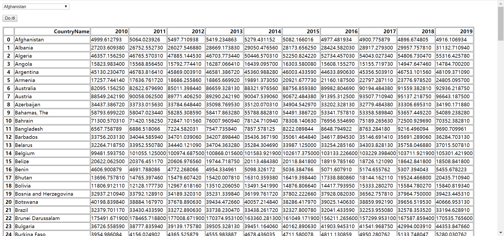
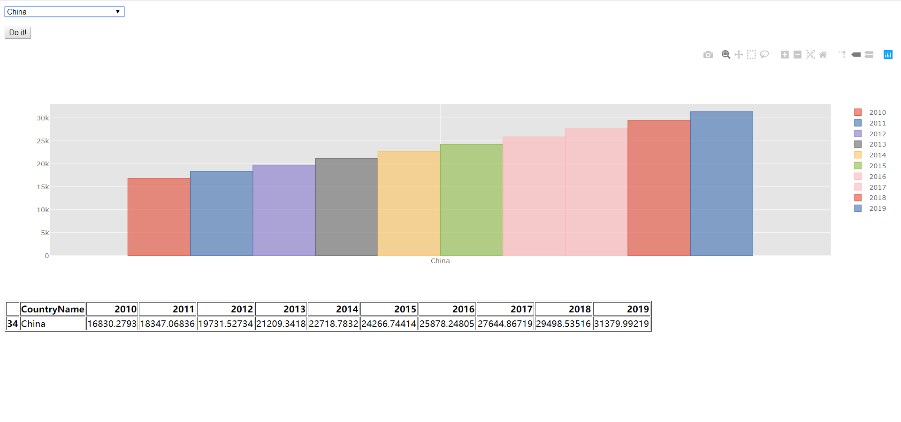
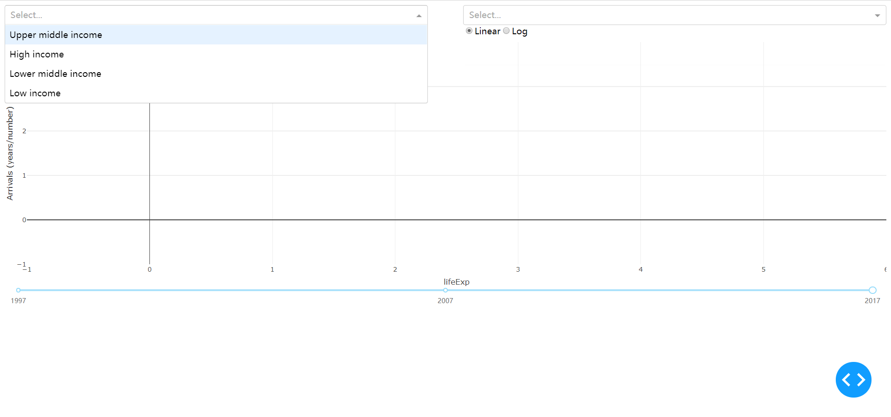
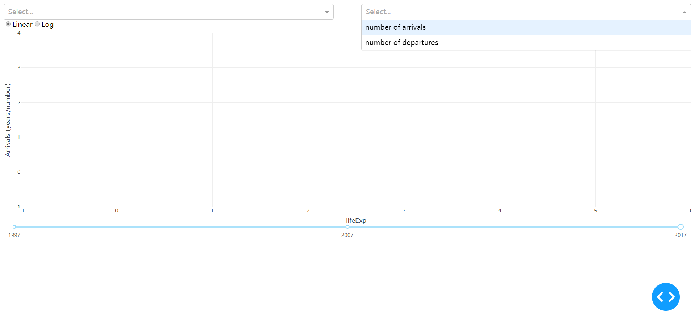
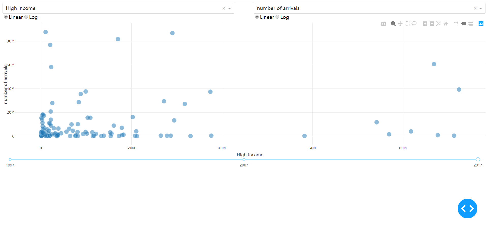
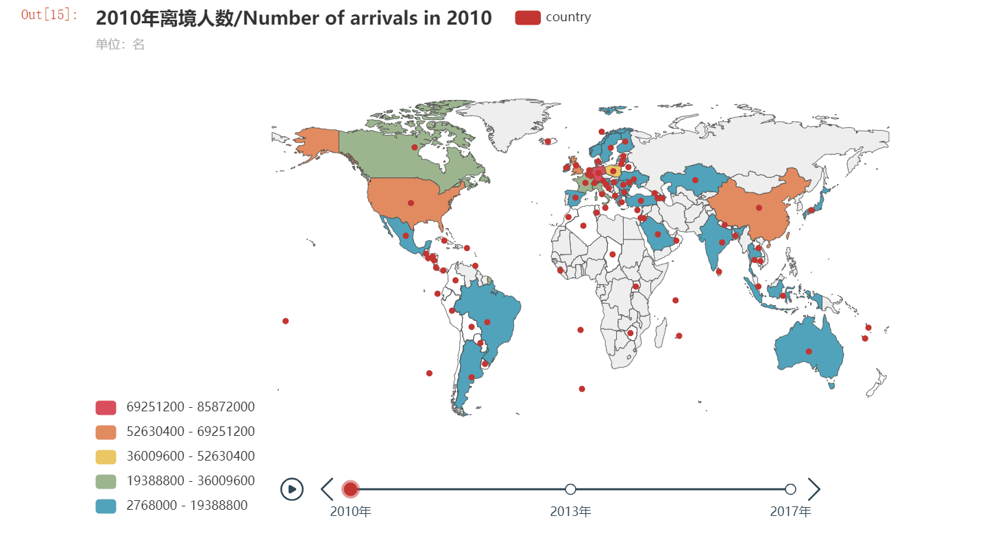
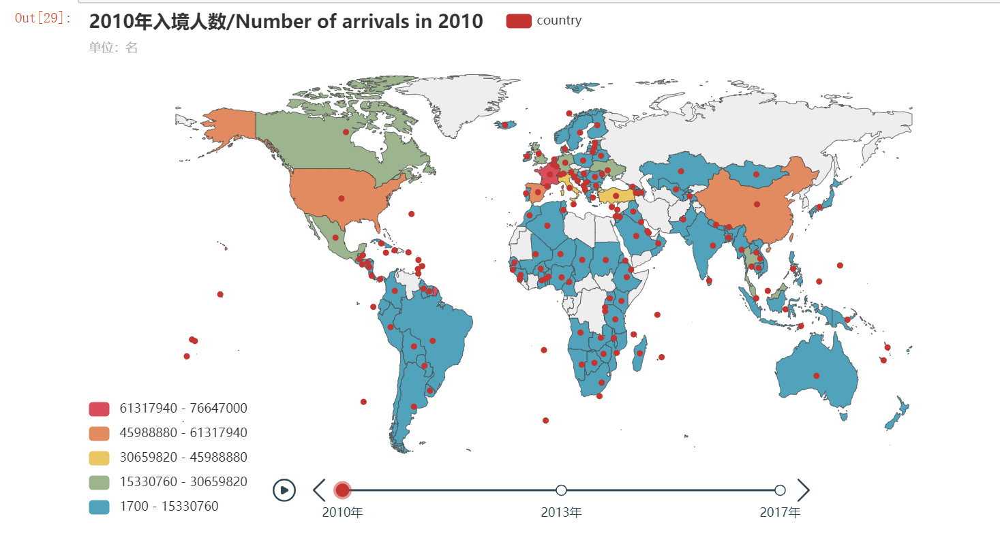
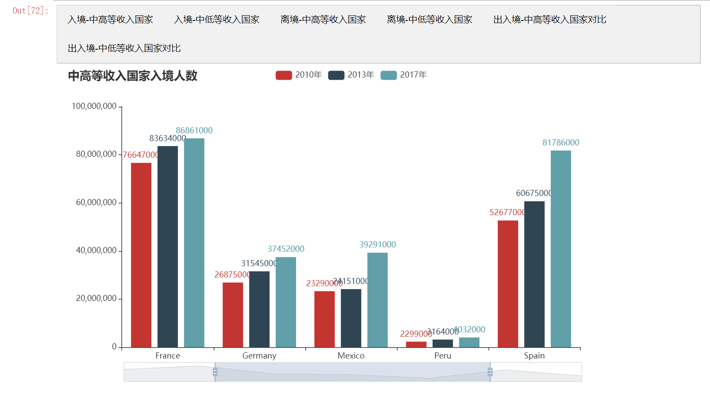
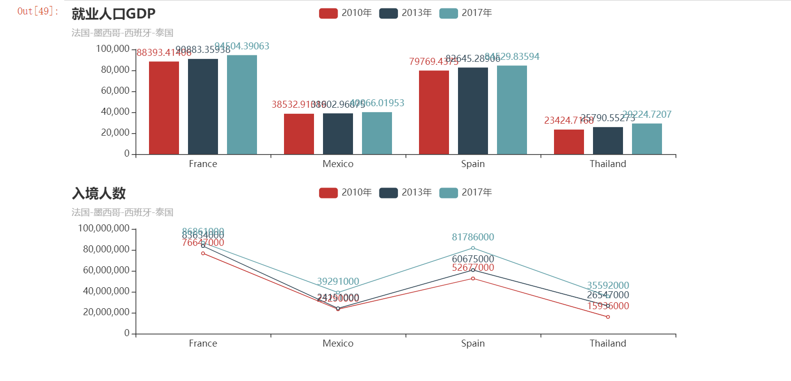
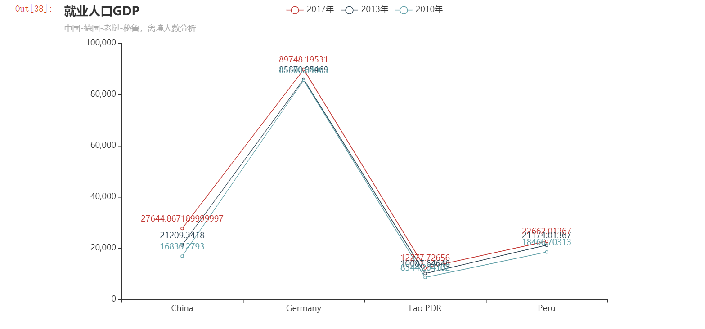

## 研究前因
随着经济水平和互联网迅猛传播的发展，越来越多的人改变其固有的金钱思维，开始向往起旅游的乐趣及享受异域文化。

参考新闻：
- [出入境游新闻](http://news.sina.com.cn/o/2018-08-31/doc-ihinpmnq4222636.shtml)

## 研究目的
- 国际入境人数与离境人数的对比是否与各国就业人口的人均GDP直接联系 
- 分析入境人数是否能带动各国旅游项目的收入
- 以趋势分析未来几年哪几个国家旅游业兴旺

## 初步研究
#### 设想
| 入境人数和离境人数的关系 | 初步结论                                                                                                                    |
| ------------------------ | --------------------------------------------------------------------------------------------------------------------------- |
| 两者皆位居前列           | 其国家就业人口人均GDP会处于一个较高的水平，人们的思想会相对比较开放、自我需求会比较高，懂得赚钱与花钱                       |
| 入境>>>离境              | 大可猜想到东南亚地区，经济消费水平较低，容易吸引较多的游客，可能会带动旅游项目的收入，但他们当地就业人口的人均GDP可能不太高 |
| 入境<<<离境              | 可猜想到此国就业人口人均GDP较高，有前瞻思想，但国家旅游业未开发或是不以旅游业为主                                           |

#### 初步深入洞察
按高收入和低收入国家来分，是希望得出入境人数会不会受当地经济水平的影响而做出选择不同的目的地的结果，并得出全世界、高收入国家、低收入国家的人会更偏向去哪些地方旅游，从而进一步分析人们的价值观以及热门国家热门的原因。

## 数据清洗以及丰富程度
#### 数据来源
- World Bank

#### 需要的数据
- 国际就业人口的人均GDP
- 国际入境人数
- 国际离境人数

#### 数据清洗
- 小批量手动清洗
- jupyter缺失值的清洗
- jupyter特定值的筛选

#### 使用技能
- 数据清洗
- pyechart,flask,dash制作图表
- 交互按钮
- css元素

## 数据故事的价值性
根据研究目的得出的结果我们可以：
1. 帮助不知道去哪个国家旅游的人们提供一些关于旅游热门地的信息从此便可进一步了解这些国家的魅力点
2. 帮助人们挖掘小众旅游地
3. 在就业人均GDP不算高的情况下推荐消费水平中等且具有民族文化特点的国家
4. 关注旅游业发展的趋势，提供向外创业或发展的线索
5. 探究当今社会人们的旅游思想是否转变了日常金钱消费思维

## Flask
- 

- 

## Dash
x轴和y轴设置不同的指标选择，如下图一二：

- 

- 

- 

## 交互图表 [地图]
- [交互地图](http://nfunm071.gitee.io/interactive_visual_final/) 打开链接可查看完整的交互地图，内含**时间轴世界地图图表**。

- 

- 

## 交互图表 [非地图]
- [交互地图](http://nfunm071.gitee.io/interactive_visual_final/) 打开链接下方可查看**选项卡图表**、**组合图表**以及**普通图表**。

- 

- 

- 

## 故事总结
#### 离境人数图表
- 科普：
国际出境游客是指从惯常居住国去往任何其他国家。出境游客数据是指离境人数，而不是旅行人数。因此，如果某人在特定时期内多次离开某国去旅行，则每次旅行时都算作一次离境。

- 小结：
从2010年到2013年间，可明显看出世界地图上的颜色丰富多样了，即三年间某些国家或地区离境人数有着明显变动。

2010年出境人数最多的国家为德国，2013年为中国和德国，2017年为中国。

2010年到2017年中国出境人数呈现高速增长，德国出境人数小幅增长但程度没那么高。处于其他层级的美国、波兰等地都是呈小幅增长，基本上在八年间里所有的国家的出境人数都是在增多的。除此之外，某些国家或地区例如秘鲁、老挝等从极少到有明显颜色中变化。

#### 入境人数图表
- 科普：
国际入境游客（过夜游客）是指到一个非惯常居住国旅行、脱离其惯常环境、旅行时间不超过 12 个月。一些国家将在海外居住的公民入境也计算在内，其他国家则不然。入境游客数据是指入境人数，而不是旅行者人数。因此，如果某人在给定时期内多次到某国旅行，则每次旅行时都会算作一次入境。

- 小结：
总体上看，入境人数在每一年里都是有一定数量的。从2010年到2017年间，可明显看出世界地图上的高层级颜色增加了，即三年间某些国家或地区入境人数有着明显变动。

2010年入境人数最多的国家为法国； 2013年为法国和美国； 2017年为法国、美国和西班牙

2010年到2013年法国入境人数呈现高速增长，但到了2013年到2017年间，法国入境人数虽保持在一定区域，但增长范围小了许多。反倒是西班牙在2013年到2017年间入境人数大幅上涨。处于其他层级的英国、中国、墨西哥、土耳其和意大利等地都是呈小幅增长，基本上在八年间里所有的国家的入境人数都是在增多的。仅仅从颜色来看，最明显的变化是美国、墨西哥、德国、西班牙、英国及泰国。

#### 就业人口人均GDP图表
- 科普：
就业人口的人均 GDP 是国内生产总值 (GDP) 除以经济体中的就业人口总数。 国际元的购买力与美元在美国的购买力相当。

- 小结：
上图四个国家2010-2013-2017年就业人口GDP对比中可发现，
 1. 四个国家在2010-2017年间GDP都是呈上升趋势
 2. 德国就业人口GDP最高，在85,000的区间以上
 3. 老挝就业人口GDP最低，在8,500的区间以上，德国是老挝的十倍
 4. GDP上升得最明显的是中国
 
#### 离境人数与就业人口GDP结合分析：

1. 2010年出境人数最多的国家为德国，德国是一个高度发达的国家，就业人口GDP一直处于比较居前的位置，经济较其他三个国家来说富裕得多。

 成为第一出境游大国的原因[1]：

 - 经济的恢复,以及相较于三十年代法定劳动时间的缩短和战后大多数人渴望忘记战争的伤痛、极力追求美好事物的愿望;
 - 其次,德国法定带薪休假日长达三十天,居于世界首位。
 - 第三,德国传统的徒步游情结也可以对德国人如此喜爱旅游进行解释。
[2]资料显示，一度是世界上出境旅游人数最多的国家，德国人热爱出外旅游来享受假期。据德国旅游协会统计，德国人出境游的主要目的地为地中海沿岸国家，如西班牙、土耳其、希腊。从上世纪60年代开始，有越来越多的德国人去国外旅游，不断认识和了解其他民族和文化，积累了旅游经验。

2. 2013年出境人数最多的国家为中国，虽与德国同处世界出境人数最高的层级，可从数量来看中国已超越德国成为世界第一。

 中国超越德国成为出境人数最多的国家原因如下：

 - 我国综合国力不断增强，政府的政策相应放宽，例如丝绸之路让人们了解别国的文化；
 - 我国就业人口GDP也相对应上升，因此人们生活水平的大幅度提高；
 - 互联网时代使得人们对别国的文化、建筑、美食等等有着更多的向往；
 - 旅游观念的转变，人们不再把目光仅限于国内，好奇驱使他们走出国门开拓视野

3. 2017年为中国。
 - 当前，中国居民的可支配收入也仍然会不断增加；
 - 中国政府不断出台一系列对出境旅游利好的政策，更加简化与便捷出境旅游程序，更好地方便中国公民出境旅游。
 - 出境旅游消费群体不断呈现出大众化、平民化的趋势，出境游消费群体不断向中低收入阶层扩展，向中等收入人群和中等消费水平转变。 
 
包括上图的老挝和秘鲁，整个世界的离境人数以及GDP都是呈上升趋势的。这说明时代的变化使得更多的人对出外旅游思想的转变或者是移民到别国，人们已将旅游当成是释放压力的一部分，它带给人的更多是精神上的和肉体上的愉悦，让一个人的格局变大，尝试很多新的东西等。生活于一个一成不变的环境也会限制人们的想象，而自然环境好、食品安全系数高、医疗保障高、教育体制好等吸引人们移民。

[1-二战后德国人的出境旅游行为](http://xuewen.cnki.net/CMFD-2008016059.nh.html) ; [2-德国人的旅游](http://www.sohu.com/a/290086652_236308) ; [3-中德旅游方式对比](http://finance.sina.com.cn/zl/international/20130719/133416181975.shtml)

#### 入境人数与就业人口GDP结合分析：
1. 2010-2017年入境人数最多的国家为法国，就业人口GDP相对于其他三国处于第一的位置，经济较其他三个国家来说富裕得多。

成为第一入境大国的原因[1]：

 - 法国与8个国家交界，邻国游客入境更容易。
 - 巴黎的形象，法国一直有浪漫之都的美誉，吸引众多游客
 - 2010年，法国美食被联合国教科文组织认定为“非物质文化遗产”。
 - 过路游客多，法国游客中有相当一部分是经由法国去西班牙、意大利或其他国家旅游的。这些游客只要在法国住一晚上，就统计为法国游客了。 [2]资料显示，一度是世界上出境旅游人数最多的国家，德国人热爱出外旅游来享受假期。据德国旅游协会统计，德国人出境游的主要目的地为地中海沿岸国家，如西班牙、土耳其、希腊。从上世纪60年代开始，有越来越多的德国人去国外旅游，不断认识和了解其他民族和文化，积累了旅游经验。

2. 2017年西班牙入境人数大幅增加，次于法国仅居世界第二入境大国，西班牙是中等发达的资本主义国家

西班牙入境人数猛增的原因[2]：

 - 西班牙旅游业和与之相关的产业，占到了西班牙GDP的16%，远远超越了足球产业
 - 政府大力发展旅游业，西班牙每年都要参加上百次在世界各地举办的旅游专业性活动
 - 西班牙是一个热情奔放著称的国家，拥有独特的民俗节日以及民间歌舞等特色文化，例如斗牛比赛、番茄大战、弗拉门戈舞蹈等等。

3. 泰国就业人口GDP低但却是消费水平低吸引中低等收入人群、以及蜜月度假等首选之处。

 - 泰国气候一年四季炎热，特别对于冬季寒冷的地区来说，人们更向往去泰国等东南亚地区避寒
 - 签证方便且机票便宜，落地签即可，适合随时出游的旅客
 - 热带水果以及各种特色美食的双重暴击。整体来说，泰国美食味美价廉，口味较大众。
 - 泰国的特色文化以及夜市是年轻人出游的首选。泰国是一个具有强大包容性的国家，永远不会让人觉得无趣，各种强烈的反差吸引每年上千万的游客慕名而来。你可以去参观庙宇，也可以来享受灯红酒绿的夜生活。
 - 物美价廉，且当地美妆品牌知名度和性价比高，导致许多游客去泰国抱着买买买的心态
 - 体验潜水的不二之选。
 
当然，墨西哥入境人数增加的原因也不外乎以上所列。总的来说，人们以前会更向往前端潮流文化的法国等大国，而现在思想和时代使得越来越多的人想旅游甚至是出国，东南亚或南美洲的小国相对来说便是更好的选择，首先物价比较良心；其次是文化更多样，例如墨西哥印第安人的灿烂文化；美食也更多样了，从以前只听闻的“法国蜗牛”、“意大利披萨”再到墨西哥“卷饼"、“西班牙火腿”等等，人们的眼界再次被打开。[4]

[1-法国游客为什么多？](http://blog.sciencenet.cn/blog-1557-1073177.html) ; [2-旅游业为什么是西班牙的“命根子”？](https://zhuanlan.zhihu.com/p/59146509) ; [3-为什么中国人旅游都爱去泰国？](https://zhuanlan.zhihu.com/p/50774226) ; [4-西班牙美食](https://www.zhihu.com/question/28131572)

## 总结
- 从2010年、2013年、2017年三年来看，**离境人数**较多的几个国家不外乎德国、中国、美国和英国，值得一提的是中国离境人数是逐年增多的，德国一直保持居于高位。
- 从2010年、2013年、2017年三年来看，**入境人数**较多的几个国家为法国、美国、中国、西班牙、土耳其和意大利。而西班牙、中国和土耳其这三个国家是从2013年呈现猛冲趋势，泰国和墨西哥入境人数也增多了不少。
- 三年度**就业人口人均GDP**中呈现每一国家GDP都是逐年增长的。且上述几个国家中大多都是发达国家、高收入水平国家或中高等收入国家。
- 从而得出：
  1. GDP增长带动每国国民经济方面的宽裕。
  2. 离境人数多的国家一般经济较发达，人们收入水平较高。
  3. 入境人数多的国家从一开始的大都市发展到小国。猜想几年后主流国家依旧多人入境，但东南亚等小国会越来越受欢迎，带动当地旅游业发展。
  4. 墨西哥、西班牙等南美洲，泰国等东南亚小国在中高等收入水平国家来说是几年后较为热门的旅游地。
  5. 南亚的印度、东南亚的印度尼西亚、菲律宾和越南的入境人数将会继续呈现上升趋势，特别是越南。
  6. 中高等收入水平国家离境人数预测方面中国将会是此收入水平的领军者，越来越多的国民走向世界、开拓眼界。
  7. 中低等收入水平国家离境人数的领军国家则是印度，其它国家反而上升趋势较弱，与GDP水平有关。
  8. 中高等收入国家出入境人数对比可看出中国、德国出境>>入境，而法国、西班牙、泰国的出境人数>>入境人数。表明中国、德国前几年发展重心并不在旅游业上，而后几年中国“一带一路”或许会吸引更多的游客。法国、西班牙、泰国等国是以旅游业为重心的国家，后几年仍会继续大力发展旅游业。
  9. 中低等收入国家除印度外基本上出境人数<入境人数，大多都是发展旅游业。
  10. 在互联网发展的时代下，相信往后几年会越来越多人前往不同的国家，而目前许多国家已把旅游发展提上日程，猜测旅游业能大力带动各国的经济发展。
