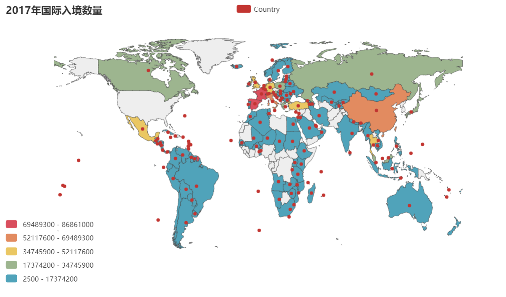

### 研究项目
- 国际入境人数与离境人数的对比是否与各国就业人口的人均GDP直接联系 
- 分析入境人数是否能带动各国旅游项目的收入

### 数据来源
- 世界银行

### 需要的数据
- 国际就业人口的人均GDP
- 国际入境人数
- 国际离境人数
- 国际旅游项目收入
- 国家经济水平分类

### 使用技能
- 数据清洗
- plotly或pyechart制作图表
- 交互按钮
- css元素

### 设想
| 入境人数和离境人数的关系 | 初步结论                                                                                                                    |
| ------------------------ | --------------------------------------------------------------------------------------------------------------------------- |
| 两者皆位居前列           | 其国家就业人口人均GDP会处于一个较高的水平，人们的思想会相对比较开放、自我需求会比较高，懂得赚钱与花钱                       |
| 入境>>>离境              | 大可猜想到东南亚地区，经济消费水平较低，容易吸引较多的游客，可能会带动旅游项目的收入，但他们当地就业人口的人均GDP可能不太高 |
| 入境<<<离境              | 可猜想到此国就业人口人均GDP较高，有前瞻思想，但国家旅游业未开发或是不以旅游业为主                                           |

如下图以世界地图为主的图表

